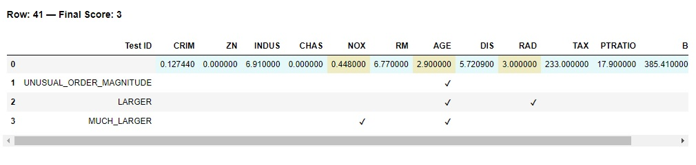
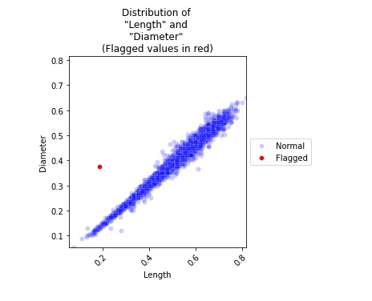
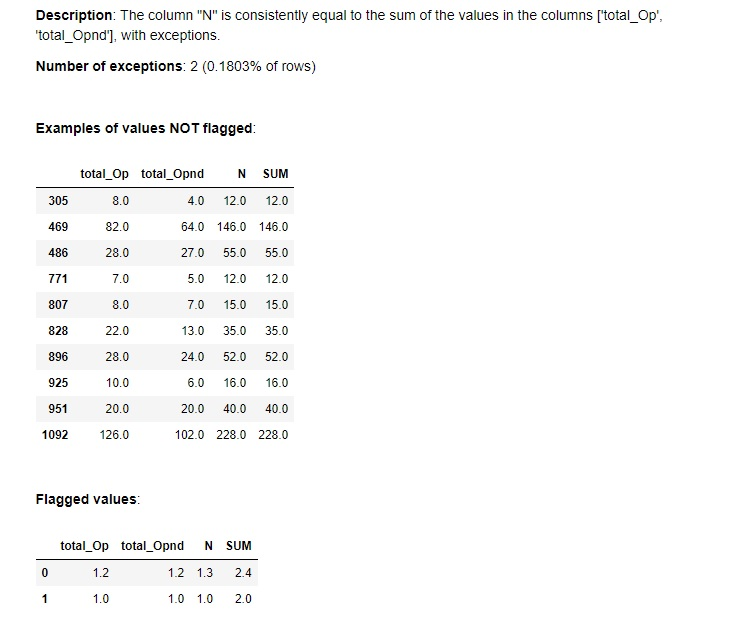

# Examples

The [`Demo Notebooks`](https://github.com/DiogoRibeiro7/DataConsistencyChecker/tree/main/Demo%20Notebooks)
folder contains worked examples on real and synthetic datasets. GitHub may not render some of the notebooks'
background colours.

| Notebook | Shows |
|---|---|
| [California Housing](https://github.com/DiogoRibeiro7/DataConsistencyChecker/blob/main/Demo%20Notebooks/Demo_California_Housing.ipynb) | A typical first look at a dataset with `quick_report()`, then details on selected findings. |
| [Breast Cancer](https://github.com/DiogoRibeiro7/DataConsistencyChecker/blob/main/Demo%20Notebooks/Demo_Real_Breast_Cancer.ipynb) | Another typical review, using a different set of methods. |
| [Hypothyroid](https://github.com/DiogoRibeiro7/DataConsistencyChecker/blob/main/Demo%20Notebooks/Demo_Hypothyroid.ipynb) | Listing the findings and looking more closely at the most interesting ones. |
| [APIs](https://github.com/DiogoRibeiro7/DataConsistencyChecker/blob/main/Demo%20Notebooks/Demo_APIs.ipynb) | Many of the less common methods, on the Boston Housing dataset. |
| [Clearing issues](https://github.com/DiogoRibeiro7/DataConsistencyChecker/blob/main/Demo%20Notebooks/Demo_Clear_Issues.ipynb) | Pruning findings with `clear_results()` and `restore_results()`. |
| [Multiple executions](https://github.com/DiogoRibeiro7/DataConsistencyChecker/blob/main/Demo%20Notebooks/Demo_Multiple_Executions.ipynb) | Replacing results with a new run, or appending runs to build up a complete set. |
| [OpenML datasets](https://github.com/DiogoRibeiro7/DataConsistencyChecker/blob/main/Demo%20Notebooks/Demo_OpenML_Datasets.ipynb) | A few findings on each of several OpenML datasets. |
| [Demonstrating a check](https://github.com/DiogoRibeiro7/DataConsistencyChecker/blob/main/Demo%20Notebooks/Demo_Test_Method.ipynb) | `demo_test()` on synthetic data. |

## What the output looks like

A row flagged by three checks (so with a score of 3), shown by `display_most_flagged_rows()`. Each check that
flagged the row has a checkmark under the columns involved:

A plot of two correlated columns, with the one exception in red:

The detailed display of a column equal to the sum of two others, with examples of rows that follow the
pattern and the two rows that break it:

The checks can find columns that are correlated or identical, a column that is (approximately) the sum,
product, ratio or difference of others, a column predictable from others with a small decision tree or linear
regression, monotonically increasing values, cyclical patterns and more; see the [checks catalog](checks.md).
